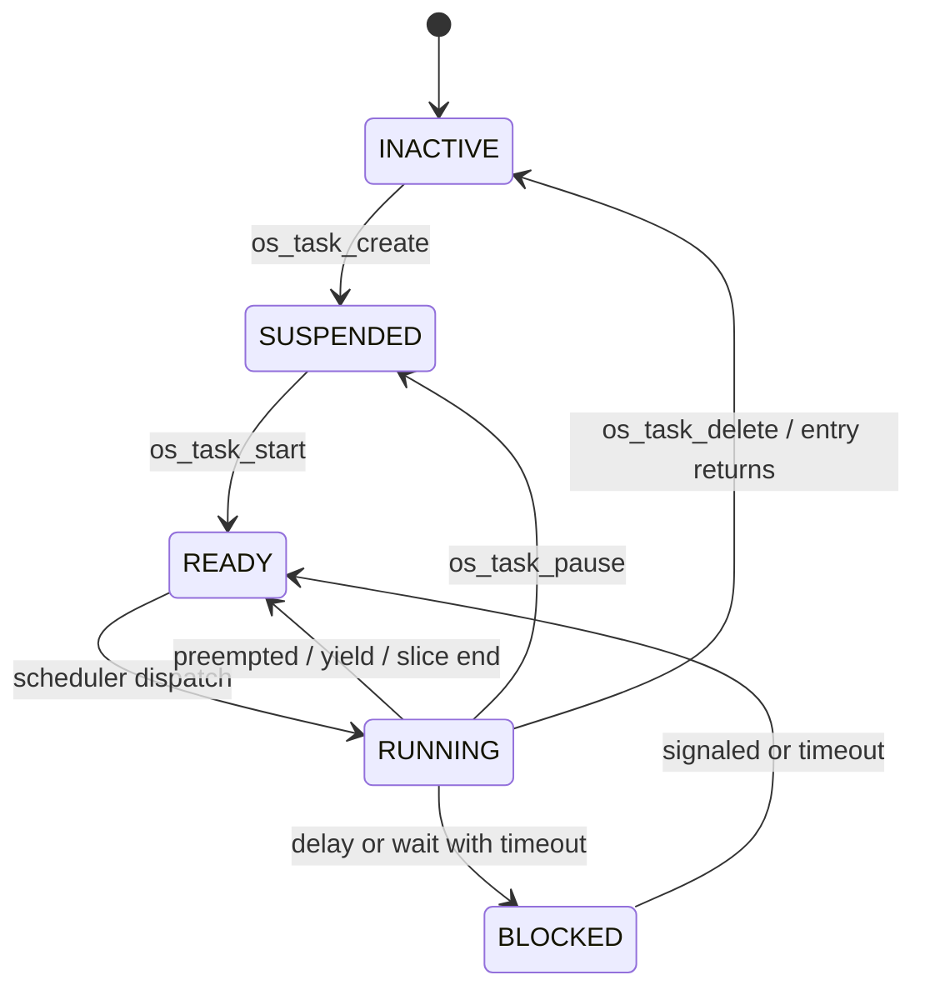
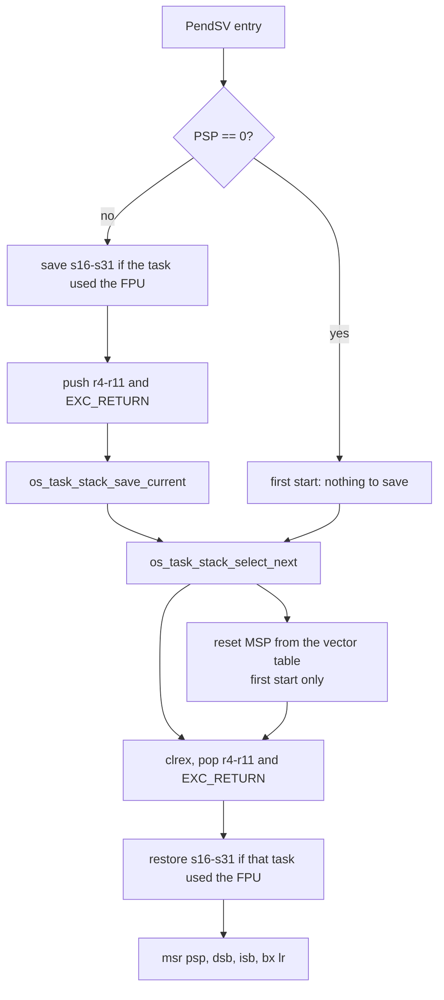

# How the kernel works

[← Back to the documentation index](README.md) · [Kernel reference](kernel.md)

How the kernel actually works: boot, scheduling, the context switch, the tick,
blocking and waking, and where the RAM goes. Read this to change the kernel;
read [Using the kernel](api.md) to use it.


This part is the mechanism: which data structures exist, what runs on every
tick, what a context switch physically does, and why each piece is where it is.
[Using the kernel](api.md#using-the-kernel) covers the same subsystems from the API
side - what to call and what it guarantees.

### Boot sequence

`os_init()` builds the kernel in a fixed order, then `os_start()` hands the CPU
to the first task and never comes back.

| Step | Call | What it does |
|---|---|---|
| 1 | `os_arch_init()` | Verifies the vector table, primes the PSP sentinel, sets exception priorities, brings up the cycle counter |
| 2 | `os_task_system_init()` | Clears the TCB table, empties the 32 ready lists, the bitmap and the delay list |
| 3 | `os_task_idle_create()` | One idle task per scheduling core, at `OS_TASK_PRIO_IDLE`, outside the task table |
| 5 | `os_timer_system_init()` | `tsk_timer`, if `OS_CONFIG_TIMER_ENABLE` |
| 6 | `os_log_system_init()` | `tsk_log`, if `OS_CONFIG_LOG_ENABLE` - created before the application task, so anything logged at startup already has a consumer |
| 7 | `os_main_system_init()` **or** `os_test_system_init()` | `tsk_main` running `os_main()`, or `tsk_test` running `os_test()` in a self-test build. Never both |
| 8 | `os_tick_init()` | Zeroes the tick counter and starts the tick source (or calls `os_arch_tick_init_cb()` with an external tick) |

Everything above runs with the scheduler stopped, on the boot (MSP) stack. No
task executes yet - creation only fills in a TCB and pushes it onto a ready
list.

**What `os_arch_init()` checks.** Misintegration is caught here rather than
allowed to become a silent hang:

- **The vector table.** With `OS_CONFIG_ARCH_VECTOR_CHECK` (default on), the
  port reads entry 14 through VTOR and compares it against the address its own
  handler assembled to. A mismatch parks the core immediately in
  `os_arch_config_fault_trap()`, where a debugger lands on the cause. Without
  that check, the failure mode is a board that reaches `os_start()` and stops
  dead - no fault, no output, nothing to attach to.
- **The interrupt-mask configuration.** With a nonzero
  `OS_CONFIG_MAX_SYSCALL_IRQ_PRIORITY`, the value must fit the device's
  implemented priority bits exactly, and NVIC grouping must give every
  implemented bit to preemption. Both are read back from the hardware and
  verified.
- **The cycle counter.** DWT CYCCNT is architecturally optional, may report
  `DWT_CTRL.NOCYCCNT`, and on several devices sits behind a debug power domain
  that refuses the enable until a debugger attaches. All three cases are
  checked, and a SysTick-derived counter is selected instead when needed - which
  is also the only counter ARMv6-M has. Without that fallback `os_delay_us()`
  would spin forever on such a part.

`os_arch_init()` also sets PendSV and SysTick to the **lowest** exception
priority, so neither can ever preempt an application interrupt, and writes
`PSP = 0` - the sentinel the context switch reads as "no task has run yet".

**What `os_start()` does.** It asserts that the idle task exists (without one,
the first restore would dereference a NULL stack pointer), sets the running
flag, and calls `os_arch_start_first_task()`, which switches `CONTROL` to use
PSP, re-writes the `PSP = 0` sentinel, and pends PendSV. Since PendSV is the
lowest priority and interrupts are enabled, it is taken immediately; the
function after it is never reached.

### Tasks and the TCB

A task is a stack plus a control block. `OS_TASK_DEFINE(name, stack_bytes)`
declares both at file scope and binds them to a handle at compile time;
`os_task_create` fills in the TCB from an `os_task_config_t` and claims a slot
in the static table.

The TCB (`os_task_tcb_t`, private to `os_task.c`) holds:

| Field group | Contents |
|---|---|
| Identity | `name` (kept only for debugger and trace visibility - the kernel never reads it), `id`, `system_task` flag |
| Stack | `stack_base`, `stack_bytes`, and `stack_ptr` - the saved PSP, written by the context switch |
| Scheduling | `priority` (effective), `state`, `core_affinity`, `running_core`, `delay_ticks` |
| List membership | `state_node` - links into **one** ready list or the delay list; `wait_node` - links into **one** object's waiter list |
| Wait bookkeeping | `wait_list`, `wait_signaled`, `wait_data[2]`, `wait_result`, `woken_from` |
| Mutex (optional) | `base_priority` and an `owned_mutexes` list, for priority inheritance |
| Notify (optional) | A one-word mailbox: `value`, `pending`, `waiting` |

Two separate list nodes is what lets a task be on a waiter list and the delay
list at the same time - which is exactly what a `timeout_ms` wait is.

**The task table is sized to mean what it says.**

```text
OS_TASK_TABLE_SIZE = OS_CONFIG_MAX_USER_TASKS
                   + 1                              (tsk_main or tsk_test)
                   + 1 per enabled timer / work / log service
```

So enabling the log or the timer task never quietly costs the application a
task slot. The idle tasks live outside the table entirely, one per core.

**States.** `os_task_state_get()` reports one of five:



A created-but-not-started task is `SUSPENDED`, so `os_task_start` is a real
step rather than a formality. A task whose entry function returns is not a
fault: the kernel wraps every entry so the return lands in `os_task_exit()`,
which deletes the task cleanly.

### The scheduler

Three structures, all static, all shared between cores on an SMP build:

```c
static os_list_t os_task_ready_list[OS_TASK_PRIO_MAX + 1U];  /* 32 FIFO lists  */
static uint32_t  os_task_ready_bitmap;                       /* bit n = list n non-empty */
static os_list_t os_task_delay_list;                         /* finite-delay sleepers    */
```

**Picking the next task is O(1).** `os_task_stack_select_next()` asks
`os_arch_highest_bit_get()` for the highest set bit in the bitmap - a single
`CLZ` instruction on ARMv7-M and up - indexes straight into that priority's
list, and takes the head. Removing the last member clears the bit. There is no
scan over tasks and no priority queue to re-heap, so the cost does not depend on
how many tasks exist or how many priorities are in use.

**Round-robin is list rotation.** A task that was preempted while `RUNNING` goes
back to the **tail** of its own priority's list in
`os_task_stack_save_current()`; the next pick takes the head. Nothing is sorted,
and equal-priority tasks therefore rotate in FIFO order for free. A task that
blocked or suspended itself keeps its state - it is already in the right list,
or in none - and the idle tasks are never queued at all.

**Who is not in any list:** the running task on each core (it is in
`os_task_current[core]`), `OS_WAIT_FOREVER` sleepers (only an explicit wake
releases them, so a tick has no reason to walk past them), suspended tasks, and
the idle tasks.

**The time slice.** `os_task_slice_left[core]` is reloaded to
`OS_CONFIG_TIME_SLICE_TICKS` every time a task is dispatched - including a task
re-dispatched immediately after a yield, which is what makes `os_task_yield()` a
genuine restart rather than a way to inherit the tail of the previous slice.
`os_task_slice_tick()` counts it down once per tick, on every core. Only this
core writes that counter, and a 32-bit store is indivisible, so it needs no
lock.

**Deciding whether a tick should switch at all.**
`os_task_reschedule_possible()` answers in three tests, cheapest first:

| Test | Result |
|---|---|
| Scheduler locked on this core | `false` outright |
| Any ready bit **strictly above** the running priority | `true` - a real preemption is due |
| Slice exhausted **and** a ready bit at the running priority | `true` - a peer's turn has come |

Because the running task is never queued, "a bit at my own priority" can only
mean a peer is waiting. The tick calls this before pending PendSV, so a tick
that would not switch anything costs one bitmap check instead of a full
exception round trip - which, with a quantum above 1, is most ticks.

### The context switch

PendSV does everything, in one handler, for both jobs: starting the very first
task and switching between two running ones.



**The frame on a task stack**, low address first:

```text
[ s16-s31 ]   only when the task was using the FPU (EXC_RETURN bit 4 clear)
r4-r11, EXC_RETURN
[ hardware frame: r0-r3, r12, lr, pc, xpsr, (s0-s15, fpscr) ]
```

The hardware pushes the bottom group on exception entry; the handler pushes the
middle group. Details worth knowing:

- **`EXC_RETURN` is saved *with* the context**, per task. That is what lets one
  task have an FPU frame and another not, which is mandatory with
  `-mfloat-abi=hard` where any task - or the startup code - may touch the FPU.
- **`clrex` on the restore path** drops any `LDREX` reservation the outgoing
  task left behind, so an interrupted atomic cannot have its `STREX` succeed in
  a different context.
- **`os_task_stack_select_next()` never returns NULL.** The idle task always
  exists, so the restore path needs no fallback branch.
- **The first start abandons the boot context.** With `PSP == 0` there is
  nothing to save, so the handler resets MSP to the initial value from the
  vector table - discarding `main()`'s frame and the exception frame it just
  pushed - and returns through PSP into the first task. The MSP stack is then
  the handler stack, as intended.

**What changes per architecture:**

| Port | Cores | Differences |
|---|---|---|
| `v7m` | M3, M4, M7 | Thumb-2, FPU-aware (`s16-s31` + per-task `EXC_RETURN`), BASEPRI available |
| `v8m` | M33, M35P, M52, M55, M85 | A superset of v7m: also saves and restores `PSPLIM` per task, programs `MSPLIM` for the handler stack, and carries all three TrustZone modes |
| `v6m` | M0, M0+, M23 | Thumb-1 subset, no FPU, no BASEPRI (PRIMASK only), cycle counter synthesized from SysTick |

The port layer defines exactly **one** externally visible vector handler. It
does not define `SVC_Handler` (the first task starts through PendSV's `PSP == 0`
path) and does not define `SysTick_Handler` (the application routes it).

**Where the switch is requested from.** Nothing calls the scheduler directly.
Every path that can make a switch due - the tick, a wake, a yield, a priority
change, the outermost `os_kernel_unlock()` - pends PendSV, which then runs after
every other pending interrupt because it sits at the lowest priority. So a
context switch never happens in the middle of an ISR, and the switching code
exists in exactly one place.

### The tick

One tick is deliberately short. `os_tick_handler()` does this and nothing else:

1. Increment `os_tick_count` (core 0 only on an SMP build - other cores' ticks
   drive only their own preemption, or elapsed time would be counted once per
   core).
2. Count the tick for CPU-usage sampling, and additionally as idle if it
   interrupted the idle task.
4. `os_timer_tick_process(1)` - decrement active timers, mark expiries, wake
   `tsk_timer` if any fired.
5. `os_task_tick_update(1)` - walk the delay list, decrement, and make ready
   whatever reached zero.
6. `os_task_slice_tick(1)` - count down this core's quantum.
7. `os_arch_cycle_tick()` - tell the port that THIS core's tick timer just
   wrapped. A port whose cycle counter is real hardware (RISC-V `mcycle`, ARM
   DWT `CYCCNT`) defines it as an inline no-op; a port that has to synthesize
   one from the tick timer counts the period here. It has to be the interrupt
   rather than a flag read by whoever happens to call: a period that elapses
   while nobody is looking is otherwise lost, and the counter then runs slow and
   can even step backwards. Per core, because each core runs its own tick timer
   on its own phase while `os_tick_count` belongs to core 0 alone.
8. Pend PendSV **only if** `os_task_reschedule_possible()` says a switch would
   really happen.

Step 5 costs O(sleeping tasks), not O(task table), because only finite-delay
sleepers are in the delay list. Step 3 costs O(running timers) for the same
reason: only started timers are linked into the list the tick walks.

No callback of any kind runs in the tick. An expired timer marks its object and
wakes `tsk_timer`, and so does a deferred call becoming ready. Callbacks therefore
execute in task context, where they may use kernel APIs, block, and be preempted
like anything else.

`os_tick_announce(n)` is the same sequence for `n` ticks at once, called from
task context after a tickless sleep. It guards the counter update against a
concurrent tick interrupt; the tick handler does not need to, being the only
writer in the normal case.

### Blocking and waking

Every blocking primitive is built from the same four internal calls, so mutex,
semaphore, queue, event and notify all behave identically at the edges.

```c
os_task_wait_data_set(d0, d1);            /* optional: condition data for a match waker */
os_task_wait_begin(&object->waiters, timeout_ticks);
/* ... the caller exits its critical section; the switch happens there ... */
signaled = os_task_wait_signaled();       /* true = object signaled, false = timeout */
os_task_wait_end();                       /* consumed - every exit path calls this   */
```

**Joining a waiter list.** `os_task_wait_begin()` inserts the task into the
object's waiter list **in priority order**, sets `state = BLOCKED`, and - for a
finite timeout - also links it into the delay list with `delay_ticks` set. That
is why a wait can end two ways: `os_task_waiters_wake_one()` takes the list head
(the highest-priority waiter, FIFO among equals) and sets `wait_signaled`, while
the tick's delay-list walk unlinks the task from **both** lists and leaves
`wait_signaled` false. The two are distinguishable, so the caller returns
`OS_ERR_TIMEOUT` or retries accordingly.

**Three wake shapes**, each matching what the object means:

| Waker | Used by | Effect |
|---|---|---|
| `os_task_waiters_wake_one` | mutex unlock, semaphore give, queue send/receive | Wakes the highest-priority waiter only |
| `os_task_waiters_wake_all` | event `set_bits` | Wakes every waiter, so each re-evaluates its own bit condition |
| `os_task_waiters_wake_match` | conditional deliveries | Calls a per-waiter predicate with that waiter's two words of `wait_data`, wakes only those it confirms, and stores a per-waiter result for `os_task_wait_result_get()` |

**Wakeups are advisory, not a handover.** A woken task re-checks the condition
it was waiting on; a faster third task that took the object in between simply
sends it back to waiting. The remaining budget for that second wait is computed
by `os_internal_wait_remaining()` against the **wall clock** - the tick at which
the wait started - not by re-arming the original relative timeout. Time spent
`READY` between the wake and the re-check therefore counts against the timeout;
a relative re-arm would freeze the clock and let a busy system stretch a 10 ms
wait indefinitely.

**When a wait cannot block at all.** `os_internal_can_block()` is false in an
ISR, before `os_start()`, and while the calling core holds a scheduler lock. In
all three cases every blocking primitive degrades to its `OS_WAIT_NOTHING`
behavior rather than parking a task the kernel could not switch away from.

### Priority inheritance mechanics

The state lives in the TCB, not in the mutex: `base_priority` is what the task
was configured with, `priority` is what the scheduler actually uses, and
`owned_mutexes` is a list of the mutexes it currently holds (linked through an
`owner_node` embedded in each mutex).

- **On a contended lock**, before joining the waiter list, the blocking task
  calls `os_task_mutex_priority_inherit(owner_id)`. If the owner's effective
  priority is lower, it is raised to the waiter's - and if the owner is sitting
  in a ready list, it is moved to the list for its new priority, with the bitmap
  updated on both ends.
- **On unlock**, `os_task_mutex_owner_unlink_and_reprioritize()` removes that
  mutex from the owner's list and recomputes the owner's effective priority as
  `max(base_priority, highest waiter still queued on any mutex it still holds)`.
  Recomputing against every remaining mutex, rather than just restoring
  `base_priority`, is what keeps a task holding two contended mutexes correct.

Two limits follow directly from this design, and both are accepted rather than
worked around: the boost does not propagate through a **chain** (an owner itself
blocked on a second mutex), and it is recomputed **lazily**, at the owner's next
lock or unlock, rather than eagerly when a waiter times out. See [Mutexes and
priority inheritance](api.md#mutexes-and-priority-inheritance) for what that means in
practice.

### The three barriers

The kernel offers three different ways to make something indivisible, and they
exclude different things. Picking the wrong one is the classic source of races
that only appear under load.

| Barrier | Excludes | Does **not** exclude | Cost |
|---|---|---|---|
| `os_critical_enter/exit` | Interrupts on this core, and (SMP) other cores via the kernel spinlock | Nothing - it is the strongest | Interrupt latency for the whole region |
| `os_kernel_lock/unlock` | Other **tasks** on this core | Every ISR, and every other core | None to interrupt latency |
| `os_atomic_*` | Concurrent updates of that one word | Anything about other words | One `LDREX`/`STREX` loop, or a critical section on ARMv6-M |

**How the critical section masks.** `OS_CONFIG_MAX_SYSCALL_IRQ_PRIORITY` selects
the backend:

- **`0` (default): PRIMASK.** `cpsid i` masks everything. Every ISR may call the
  ISR-safe kernel APIs. This is the only option on cores without BASEPRI (M0,
  M0+, M23).
- **Nonzero: BASEPRI.** The kernel raises `BASEPRI` to that value with
  `basepri_max`, which only ever tightens - so a nested save can never loosen a
  threshold an outer level already raised. Interrupts **more urgent** than the
  threshold are never masked by the kernel at all, giving them zero
  kernel-induced latency, but they must not call any kernel API. ISRs at the
  threshold or below keep full API access. The value is the raw NVIC priority
  byte, already shifted into the device's implemented bits
  (`logical << (8 - __NVIC_PRIO_BITS)`), and it is verified against the hardware
  at boot.

Nesting is counted in both cases, and the mask is save/restore rather than an
unconditional enable at exit, so a critical section inside an ISR does not
re-enable interrupts on the way out.

**How the scheduler lock defers.** `os_kernel_lock()` increments a per-core
counter and nothing else - no interrupt is touched. Every path that would pend
PendSV consults that counter, and a switch that gets swallowed sets
`os_kernel_switch_pending[core]`. The outermost `os_kernel_unlock()` clears the
flag and pends PendSV *after* dropping the count to zero, so the resulting
exception finds the scheduler open and really does switch. A PendSV that was
already pending when the lock was taken still runs, and it too is caught: the
switch path sees the lock, hands the running task's own stack pointer straight
back, and records the pending flag.

### Kernel service tasks

Three of the kernel's subsystems need to run application callbacks in task
context, so each gets its own task, created by `os_init()` and protected from
`os_task_pause` / `os_task_delete` (both return `OS_ERR_BUSY`) - pausing one
would turn every later call into a silent no-op that still reported success.

| Task | Default priority | Fed by | Runs |
|---|---|---|---|
| `tsk_timer` | `OS_TASK_PRIO_MAX` | The tick, which walks the running-timer list and marks expiries | Timer callbacks, and so all deferred work |
| `tsk_log` | `OS_CONFIG_LOG_TASK_PRIORITY` (low) | `OS_LOG_*` calls from any context | Drains the log ring into `os_log_output_cb` |

**Timers** are an intrusive list of started timers, not a fixed registry. Each
`os_timer_t` carries its own `period_ticks`, `remaining_ticks`, mode, `active` /
`paused` / `queued` flags and two list nodes; the tick decrements, pushes an
expiry onto the FIFO delivery list, and wakes `tsk_timer` once for the whole
batch.

Two things follow from it being a list. **The tick walks only timers that are
actually running**, so its cost follows what the application is doing rather than
what it was compiled to allow - a build with 64 timers of which three are started
costs three iterations, not 64. And there is no capacity to exhaust, so
`os_timer_start` cannot fail and there is no `OS_CONFIG_MAX_TIMERS` to size. The
price is two pointers per `os_timer_t`: cheaper per tick, dearer per timer.

`os_timer_start` and `os_timer_stop` **search** that list rather than reading a
timer's own link pointers, so they cost O(running timers) instead of O(1) -
measured at about 11 cycles per running timer for the pair on a 250 MHz M33.
That is deliberate: it is what lets the unlink promise never to write through a
pointer an object supplied. The length walked is what is *running*, so an idle
system pays almost nothing.

A timer is also refused unless its `self` field points at the timer itself,
which only `OS_TIMER_DEFINE_PERIODIC` / `OS_TIMER_DEFINE_ONESHOT` arranges.
Because the link state lives inside the object, a hand-declared `os_timer_t`
would hand the kernel two list nodes of garbage, and `os_timer_stop` would
execute `node->prev->next = ...` - a write
through a pointer nobody chose. Four bytes per timer and one comparison per call
turn that into an `OS_ERR_INVALID_ARG`.

A self-pointer rather than a magic constant, at identical cost: a constant is
passed by any stale memory that happens to contain it, whereas this is passed
only by memory that happens to contain its own address. It also catches a timer
**copied** to another address - whose list nodes still point into the original -
which no fixed signature can detect.

**Deferred calls** are the same machinery, but a different call, because there
are two things people mean by "later". `os_timer_start` on a pending timer
**reschedules** it - the second call overwrites the first's context and value and
withdraws its expiry, so one callback runs carrying only the later event. That is
a debounce. `os_timer_submit` **queues**: each call takes its own slot from a pool
the caller declared, so an interrupt firing three times runs the callback three
times, in order, each with its own value.

Two pending calls with two different values need two pieces of storage, which no
API shape avoids. What `OS_TIMER_DEFINE_SUBMIT` arranges is *whose*: the slots are
the caller's, declared where the work is and sized by whoever knows the burst
rate, so `OS_ERR_FULL` is always local to one pool and there is no kernel-wide
number. `OS_TIMER_MODE_SUBMIT` marks an entry so delivery knows to hand it back;
an entry returns to its pool as delivery *starts*, so a callback may submit again.

Nothing is copied either way: `context` is passed through as given, `value`
travels by copy.

**The log** is a byte ring buffer of `OS_CONFIG_LOG_BUFFER_SIZE` with a head, a
tail and a dropped counter. `os_log_write` formats into an
`OS_CONFIG_LOG_LINE_MAX` scratch buffer on the **caller's** stack, then copies
the finished line into the ring under the kernel mask - whole, or not at all.
The dropped count is emitted into the log itself once space frees. `tsk_log`
runs deliberately low so draining never preempts application work, and the
transport callback runs there, never from an ISR, so it may block or start a
DMA transfer.

### The kernel heap (internals)

`OS_CONFIG_ALLOC_ENABLE` compiles in a static `uint8_t
os_mem_heap[OS_CONFIG_HEAP_SIZE]`. Nothing is taken from the linker heap, so
`malloc` and the kernel never compete, and the footprint is visible in the map
file.

Each block carries a two-word header:

```c
typedef struct os_mem_block { struct os_mem_block *next; size_t size; } os_mem_block_t;
```

Free blocks form a single **address-ordered** list starting at a static sentinel.
Allocation is **first-fit**: walk until a block is large enough, split it if the
remainder is worth keeping, and return the payload 8-byte aligned. Freeing
inserts by address and **coalesces** with the physically adjacent neighbours on
both sides, which is what keeps mixed alloc/free patterns from fragmenting
permanently - the same structure FreeRTOS's `heap_4` uses.

The walk runs inside the kernel critical section, which is what makes
`os_mem_alloc` callable from an ISR - though allocating in an ISR is discouraged
precisely because that walk runs with interrupts masked.

### Where the RAM goes

Every kernel object is statically sized, so a build's RAM cost is a sum of
`os_config.h` values:

| Consumer | Size |
|---|---|
| Task table | `(OS_CONFIG_MAX_USER_TASKS + service slots)` × `sizeof(os_task_tcb_t)` |
| Idle stacks | `OS_CONFIG_CORE_COUNT` × `OS_CONFIG_MIN_STACK_SIZE` |
| Ready lists + bitmap + delay list | 32 list heads + one word + one list head |
| Application stacks | Whatever each `OS_TASK_DEFINE` asks for |
| `tsk_main` / `tsk_test` | `OS_CONFIG_MAIN_TASK_STACK_SIZE` or `OS_CONFIG_TEST_STACK_SIZE` |
| Timer service | `OS_CONFIG_TIMER_STACK_SIZE`, and nothing else. Timers cost only their own objects - the kernel keeps no table and no pool |
| Log service | `OS_CONFIG_LOG_TASK_STACK_SIZE` + `OS_CONFIG_LOG_BUFFER_SIZE` (+ `OS_CONFIG_LOG_LINE_MAX` transiently, on the stack of whichever task logs) |
| Heap | `OS_CONFIG_HEAP_SIZE` |

Turning a feature off removes its code, its API **and** its RAM - including the
service task and stack for timer, work and log.

`OS_CONFIG_TASK_NAME_ENABLE` at `0` is the one that shrinks the task table
itself: the name pointer leaves `os_task_tcb_t`, so the saving is one pointer
per slot, and the task-name strings lose their last reference and leave flash
with it. See [Task names](api.md#diagnostics).

---


## Internals

### Source layout

#### Top-level files

- `ahura.h` is the public umbrella API, and the only header applications
  include. It reads in two parts: **PART 1** is everything no option can remove
  (types, tasks, time, critical sections, the intrusive list), so anything found
  there can be used unconditionally; **PART 2** is one group per `OS_CONFIG_`
  option, each behind a single guard covering its types, macros and functions
  together, in the same order as `os_config.h`. It declares `os_main()` and
  `os_test()` as well, even though the kernel defines neither: supplying them is
  the application's job through its `os_main.c`, or the test library's. Neither
  carries the `_cb` suffix used elsewhere in this header. That suffix is
  reserved for callbacks the kernel queries for platform behavior, such as
  `os_tickless_pre_sleep_cb`, whereas `os_main()` and `os_test()` are where the
  application's or suite's own code runs.
- `template/os_config.h` is the template for the application's `os_config.h`. It
  lists every build-time option at its default value - see
  [Configuration](integration.md#configuration) for the full table. This file is never
  included by the kernel, so copy it into the project. Disabling a feature
  compiles out its code and API, and disabling timer, work, the default task, or
  the self-test task also removes the corresponding kernel service task and its
  stack.
- `template/os_cb.c` is the template for the application-side callbacks, and is
  deliberately not compiled into the kernel. See [Application
  callbacks](porting.md#application-callbacks).
- `template/os_main.c` is the template for the default application task's body,
  also deliberately not compiled into the kernel. See [Default application
  task](api.md#default-application-task).
- `test/` holds the kernel self-test suite (`os_test.c`), its own buildable
  module with the target `os_test` and its own `CMakeLists.txt`. See [Self-test
  suite](testing.md#self-test-suite).

#### `kernel/` portable kernel modules

All filenames are `os_`-prefixed:

- `os_kernel.c` covers the lifecycle (`os_init`, `os_start`, the running flag),
  the scheduler lock, the default application task (`os_main`, see
  [Default application task](api.md#default-application-task)), and the self-test task
  (`os_test`, see [Self-test suite](testing.md#self-test-suite)).
- `os_mem.c` is the kernel heap (`os_mem_alloc` and `os_mem_free`), a first-fit
  allocator with coalescing over a static `OS_CONFIG_HEAP_SIZE` heap.
- `os_task.c` holds the static TCB pool and O(1) list-based scheduling: one FIFO
  ready list per priority plus a ready bitmap, where the highest set bit is the
  next priority to run and costs a single `CLZ` on ARMv7-M and up, round-robin
  by list rotation, and a delay list holding only the finite-delay sleepers.
  This is also where the scheduler lock's effect on dispatch and mutex priority
  inheritance's effective-priority changes live, since both are entirely about
  the TCB and the ready lists rather than about separate kernel objects. See
  [The scheduler](#the-scheduler).
- `os_notify.c` is direct-to-task notifications (`os_notify_give`,
  `os_notify_wait`). The one-word mailbox itself sits in the TCB, because it
  belongs to the task rather than to any object, so `os_task.c` hands out the
  slot and this module owns everything about what a notification means.
- `os_tick.c` is the tick counter and tick handler, which wakes delays, drives
  timers, and preempts. See [The tick](#the-tick).
- `os_delay.c` provides blocking millisecond and second delays plus a
  cycle-counter-precise microsecond busy-wait.
- `os_critical.c` implements the nesting critical section over the port's kernel
  interrupt mask - PRIMASK, or BASEPRI when
  `OS_CONFIG_MAX_SYSCALL_IRQ_PRIORITY` is nonzero. See [The three
  barriers](#the-three-barriers).
- `os_mutex.c`, `os_semaphore.c`, `os_queue.c`, and `os_event.c` are the sync
  and IPC primitives with `timeout_ms` waits, all built on the shared
  wait/wake machinery in `os_task.c`. See [Blocking and
  waking](#blocking-and-waking).
- `os_msg.c` is the variable-length sibling of `os_queue.c`, and a separate
  module rather than a mode of it because it is a ring of BYTES rather than of
  slots: each message is stored as a length header plus exactly its own bytes,
  so the capacity is one shared byte budget instead of a slot count. It uses the
  same wait/wake machinery and the same timeout rules; what it cannot share is
  the queue's slot arithmetic, which is the whole of what makes a queue cheap.
  See [Message buffers](api.md#message-buffers).
- `os_timer.c` holds the software timers. Expiry is detected by the tick and
  callbacks run on the kernel timer task `tsk_timer`, at
  `OS_CONFIG_TIMER_PRIORITY`.
- `os_log.c` is the buffered log: a static ring buffer drained by `tsk_log` into
  `os_log_output_cb`.
- `os_atomic.c` is the argument-validating wrapper layer over the port's atomic
  implementations. See [Atomics](api.md#atomics).
- `os_list.c` is the intrusive doubly-linked list. It is always compiled, since
  the scheduler itself runs on it and it cannot be configured out, and it is
  also public API.
- `os_internal.h` is the internal cross-module contract, not for applications.

#### `arch/arm/` port layer

This layer covers the tick source, the PendSV context switch (including the
first-task start), initial stack frames, the cycle counter, the interrupt mask,
and the atomics. Shared code is organized by architecture, the same split Zephyr
and CMSIS-RTX use: one v6m implementation, one v7m implementation, one v8m
implementation, with thin per-core wrapper folders on top.

`os_arch_port_common.h` is more than a header of declarations: the few helpers
small and hot enough that a cross-unit call would dominate them live there as
inline definitions rather than in a port `.c` - the interrupt mask, the in-ISR
and core-id checks, the spinlock, the boot-time vector check, and
`os_arch_atomic_load`, which is a single `LDR`. Everything with a real body is a
function in a port `.c`, declared here and nowhere else.

The layer defines exactly **one** externally visible vector handler,
`PendSV_Handler` (renameable, see [The integration
contract](integration.md#the-integration-contract)). It does not define `SVC_Handler` - the
first task is started through PendSV's `PSP == 0` path, so SVC stays free for
the application - and it does not define `SysTick_Handler`, which the
application routes to `os_tick_handler()`.

- `common/os_arch_port_v7m.c` is the ARMv7-M (M3) and ARMv7E-M (M4, M7)
  implementation. It is Thumb-2 and FPU-aware, saving `s16-s31` and a per-task
  `EXC_RETURN` when built with a hard or softfp float ABI.
- `common/os_arch_port_v8m.c` is the ARMv8-M mainline (M33, M35P) and ARMv8.1-M
  (M52, M55, M85) implementation. It is a superset of the v7m port that always
  saves and restores `PSPLIM` per task and programs `MSPLIM` for the handler
  stack when the linker script provides the stack-bottom symbol, so a stack
  overflow raises a UsageFault instead of silently corrupting memory. TrustZone,
  in all three `OS_CONFIG_TRUSTZONE` modes, lives here.
- `common/os_arch_port_v6m.c` is the ARMv6-M (M0, M0+) and ARMv8-M baseline
  (M23) implementation. It uses the Thumb-1 subset and has no FPU, and the cycle
  counter is synthesized from SysTick because these cores have no DWT CYCCNT.
  Baseline does not belong in the v8m file because it cannot execute the
  mainline Thumb-2 ISA, so its TrustZone support is handled here. Non-secure
  v8-M baseline has no `PSPLIM`, so there is no stack-limit handling.
- `common/os_arch_cycle_systick.c` is the SysTick-derived cycle counter, shared
  by all three ports. It is the only counter ARMv6-M has, and it is what the
  mainline ports fall back to when DWT CYCCNT turns out to be unavailable - the
  unit is architecturally optional, may report `DWT_CTRL.NOCYCCNT`, and on
  several devices sits behind a debug power domain that refuses the enable until
  a debugger attaches. `os_arch_init()` checks all three cases and picks once.
  Without that fallback, `os_delay_us()` on such a part would spin forever.
- `common/os_arch_atomic.c` is the atomic operation set, also shared by all
  three ports. It is one file rather than a copy per port because its own split
  - `LDREX`/`STREX` loops or a critical section, see [Atomics](api.md#atomics) - runs
  along the instruction set, not along `v6m`/`v7m`/`v8m`.
- The five files under `common/` are **textual includes**, pulled in by the
  per-core wrappers below. Never add them to a build as separate compilation
  units. The three port files each carry a `#error` guard against being compiled
  for the wrong architecture profile; the other two are pulled in by whichever
  port includes them.
- `cortex_m0/`, `cortex_m0plus/`, and `cortex_m23/` are thin wrappers over the
  v6m port.
- `cortex_m3/`, `cortex_m4/`, and `cortex_m7/` are thin wrappers over the v7m
  port. The M7 additionally relies on the DWT LAR unlock done in `os_arch_init`.
- `cortex_m33/`, `cortex_m35p/`, `cortex_m52/`, `cortex_m55/`, and
  `cortex_m85/` are thin wrappers over the v8m port. On the v8.1-M cores,
  Helium/MVE state is covered by the existing s16-s31 save plus hardware lazy
  stacking of s0-s15, FPSCR, and VPR. The folder names follow GCC's `-mcpu`
  spelling, so it is `cortex_m0plus` because the core is the M0"plus", but
  `cortex_m35p` because that core's "P" means physical security rather than plus
  (`-mcpu=cortex-m35p`).
- The build selects the variant from `-mcpu`, falling back to `-march`, so
  `armv8.1-m.main` maps to `cortex_m55` and so on. All folders of one profile
  include the same shared port, so any core of the right architecture is
  equivalent. See `AhuraRTOS/CMakeLists.txt`. Override the choice with
  `-DOS_ARCH_VARIANT=cortex_m4`. Note that GCC learned `-mcpu=cortex-m52` in GCC
  14, so older toolchains build that core with `-march=armv8.1-m.main+mve.fp`,
  which the fallback resolves automatically.
- The `MSPLIM` guard is active when the linker script provides the bottom of the
  main stack as `__StackLimit`, used by CMSIS-style scripts, or `_sstack`, used
  by several vendor-generated ones. Both are weak references, so either naming
  works unmodified, and when neither symbol exists the guard is skipped.
- TrustZone, the ARMv8-M Security Extension, is selected with
  `OS_CONFIG_TRUSTZONE`. See [TrustZone](porting.md#trustzone).
- Not covered yet: PAC/BTI (`-mbranch-protection` on the M85).

### Notes and constraints

- The kernel owns exactly one exception vector, PendSV, and needs exactly one
  call from the application, `os_tick_handler()`. `SVC` and `SysTick` are not
  claimed. See [The integration contract](integration.md#the-integration-contract).
- Do not block, whether by delaying or locking with a timeout, inside a critical
  section, a scheduler-locked region, or an ISR. Under a scheduler lock the
  kernel enforces it: blocking calls degrade to non-blocking rather than parking
  a task it cannot switch away from. See [Scheduler lock](api.md#scheduler-lock).
- The kernel's service tasks (`tsk_timer`, `tsk_log`) cannot be
  paused or deleted by the application; both calls return `OS_ERR_BUSY`.
- Timer callbacks run on the highest-priority kernel task by default, so keep
  them short or user tasks will starve. They *may* block - they run in task
  context, not in the tick ISR - but everything queued behind them waits.
- A timer's kind is chosen by the macro that declares it:
  `OS_TIMER_DEFINE_PERIODIC`, `OS_TIMER_DEFINE_ONESHOT`, or
  `OS_TIMER_DEFINE_SUBMIT` for a pool of deferred calls. There is no mode
  argument and no init call.
- `os_timer_start` on a timer that is already pending **reschedules** it, so the
  earlier context and value are replaced. Use `os_timer_submit` where every
  event must arrive - see [Deferred calls](api.md#deferred-calls).
- Mutexes are task-only and non-recursive. See [Mutexes and priority
  inheritance](api.md#mutexes-and-priority-inheritance).
- Mutex priority inheritance is single-level: it does not propagate through a
  chain of nested mutexes held by different tasks.
- With a nonzero `OS_CONFIG_MAX_SYSCALL_IRQ_PRIORITY`, ISRs above that priority
  must not call any kernel API - they are never masked, so the kernel cannot
  protect its own state against them.
- The project builds with the hard-float ABI, and the port saves and restores
  the FPU context (`s16-s31` plus a per-task `EXC_RETURN`) automatically.
